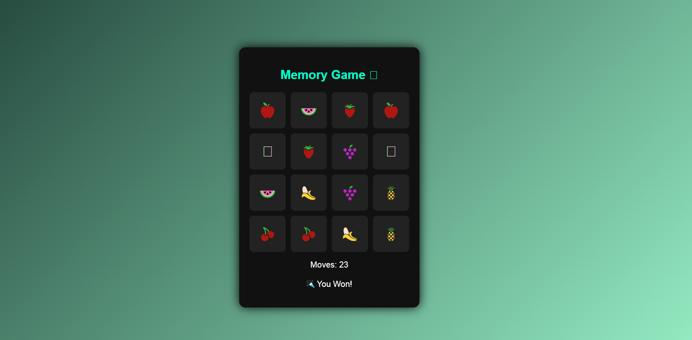

# memory-game
A simple memory game built using HTML, CSS, and JavaScript
# 🧠 Memory Game

A simple and interactive **Memory Card Game** built using **HTML, CSS, and JavaScript**.

This project helped me understand:
- DOM manipulation
- Event handling
- Game logic implementation

---

## 🎮 Game Preview

---

## 🚀 Features

- Flip cards to find matching pairs
- Move counter
- Win message when all cards are matched
- Simple and clean UI
- Beginner-friendly JavaScript logic

---

## 🛠️ Technologies Used

- HTML
- CSS
- JavaScript

---

## 📂 How to Run the Project

1. Download or clone this repository  
2. Open the `script6.html` file in any modern browser  
3. Start playing the game 🎉

---

## 🧩 How to Play

1. Click on any two cards to flip them  
2. If the cards match, they stay open  
3. If not, they flip back  
4. Match all pairs to win the game

---

## 📌 Learning Outcome

This project improved my understanding of:
- JavaScript logic building
- Working with arrays
- Handling user clicks
- Creating interactive web games

---

## 🙌 Feedback

Suggestions and feedback are always welcome 🙂
